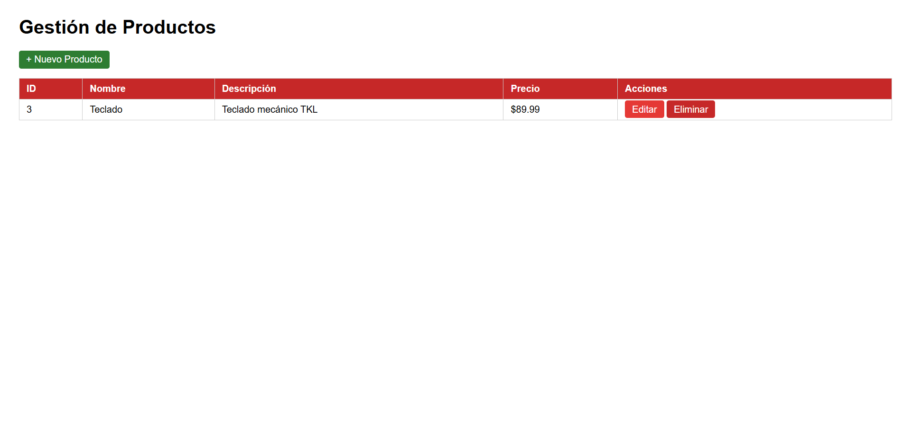

# balaguera-post1-u7

## Gestión de Productos - Spring Boot MVC

Aplicación web CRUD para gestión de productos desarrollada con Spring Boot, Thymeleaf y el patrón MVC. Usa una lista en memoria como capa de persistencia temporal e implementa el patrón Post/Redirect/Get (PRG).

## Tecnologías

- Java 23
- Spring Boot 3.2.x
- Thymeleaf
- Maven

## Estructura del Proyecto

src/main/java/com/universidad/
├── productos_web/
│   └── ProductosWebApplication.java
└── productosweb/
├── controller/ProductoController.java
├── model/Producto.java
└── service/ProductoService.java
src/main/resources/
├── templates/productos/
│   ├── lista.html
│   └── formulario.html
└── application.properties

## Cómo ejecutar

1. Clonar el repositorio:
   git clone https://github.com/WilliamBalaguera/balaguera-post1-u7.git

2. Entrar a la carpeta:
   cd balaguera-post1-u7

3. Ejecutar:
   ./mvnw spring-boot:run

4. Abrir en el navegador:
   http://localhost:8080/productos

## Funcionalidades

- Listar todos los productos
- Crear nuevo producto
- Editar producto existente
- Eliminar producto
- Patrón PRG para evitar reenvío de formularios

